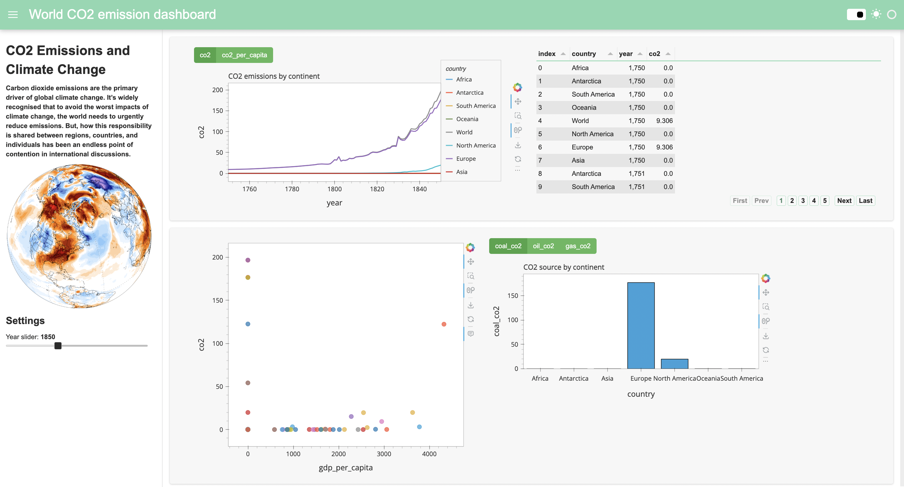

# Data Analysis: C02 Emissions Dashboard
We have created a Python visualization dashboard using Panel and Hvplot libraries to visualize information about the CO2 emissions of the world from 1750 to 2023.

The dashboard is characterized by 4 different visualizations:
1. A plot showing the CO2 emissions (or the CO2 emissions per capita) over the years by continent
2. A table displaying tge CO2 emissions over time by continent
3. A scatter plot depicting the CO2 emissions as a function of the GDP per capita 
4. A bar plot showing the CO2 source (coal, oil or gas) by continent.



To visualize the dahsboard locally, run the following command:
```
panel serve Interactive_dashboard.ipynb
```
